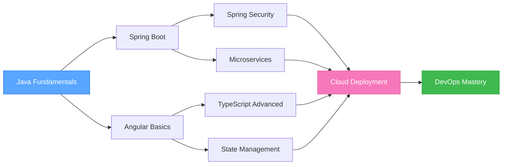

<div align="center">

<!-- Animated Header with Gradient Wave -->


<!-- Typing SVG Animation -->
<p align="center">
  <a href="https://git.io/typing-svg">
    
  </a>
</p>

<!-- Profile Views & Followers -->
<p align="center">
  
  
  
</p>

<!-- Social Media Badges -->
<p align="center">
  <a href="https://linkedin.com/in/wassel-aguech" target="_blank">
    
  </a>
  <a href="https://www.facebook.com/wasselblog" target="_blank">
    
  </a>
  <a href="https://www.instagram.com/wassel_aguech/" target="_blank">
    
  </a>
  <a href="https://www.youtube.com/channel/UCoFBqMHbsWAFdVbv7wmZBcw" target="_blank">
    
  </a>
  <a href="mailto:wasselaguech@gmail.com">
    
  </a>
</p>

</div>

---

## 👨‍💻 About Me

```typescript
const wassel = {
    name: "Wassel Aguech",
    location: "Sfax, Tunisia 🇹🇳",
    role: "Full-Stack Web Developer",
    education: "Computer Science Student",
    
    code: ["Java", "TypeScript", "JavaScript", "SQL", "HTML5", "CSS3"],
    
    technologies: {
        backEnd: {
            java: ["Spring Boot", "Spring Security", "Spring Data JPA", "Hibernate"],
            databases: ["MySQL", "PostgreSQL", "MongoDB", "SQL Server"],
            tools: ["Maven", "Postman", "Swagger API"]
        },
        frontEnd: {
            frameworks: ["Angular", "Ionic Framework"],
            styling: ["CSS3", "Bootstrap 5", "Responsive Design"],
            markup: ["HTML5", "TypeScript"]
        },
        devOps: ["Docker", "Git", "GitHub Actions", "CI/CD"],
        testing: ["Selenium", "JUnit", "Mockito"],
        cloud: ["Firebase", "Vercel"]
    },
    
    currentlyLearning: ["Microservices Architecture", "Kubernetes", "AWS Cloud"],
    currentFocus: "Building scalable enterprise applications",
    openToWork: true,
    funFact: "I turn coffee into code! ☕➡️💻"
};

console.log("Let's build something amazing together! 🚀");
```

---

## 🎯 Current Focus

<table align="center">
  <tr>
    <td width="50%">
      <h3>🌱 Currently Learning</h3>
      <ul>
        <li>🔹 Advanced Spring Boot & Microservices</li>
        <li>🔹 Angular Advanced Patterns</li>
        <li>🔹 Docker & Kubernetes</li>
        <li>🔹 DevOps & CI/CD Pipelines</li>
        <li>🔹 Cloud Architecture (AWS)</li>
      </ul>
    </td>
    <td width="50%">
      <h3>🔭 Working On</h3>
      <ul>
        <li>🔸 Enterprise Full-Stack Projects</li>
        <li>🔸 REST API Development</li>
        <li>🔸 Database Optimization</li>
        <li>🔸 Responsive Web Applications</li>
        <li>🔸 Open Source Contributions</li>
      </ul>
    </td>
  </tr>
</table>

<div align="center">

### 💬 Ask me about: Java • Spring Boot • Angular • TypeScript • Web Development
### 📫 Reach me: **wasselaguech@gmail.com**

</div>

---

## 🛠️ Tech Stack & Tools

### **Languages**
<p align="center">
  
</p>

### **Frameworks & Libraries**
<p align="center">
  
</p>

### **Databases**
<p align="center">
  
</p>

### **DevOps & Tools**
<p align="center">
  
</p>

### **Additional Skills**
<p align="center">
  
  
  
  
  
</p>

---

## 📊 GitHub Statistics

<div align="center">
   
  
</div>

<div align="center">
  
  
</div>

<p align="center">
  
</p>

---

## 🏆 GitHub Trophies

<p align="center">
  
</p>

---

## 💼 Skills Matrix

<div align="center">

| 🎯 Category | 🛠️ Technologies | 📈 Proficiency |
|------------|----------------|----------------|
| **Backend Development** | Java, Spring Boot, REST APIs, Microservices | ⭐⭐⭐⭐⭐ |
| **Frontend Development** | Angular, TypeScript, HTML5, CSS3, Bootstrap | ⭐⭐⭐⭐⭐ |
| **Database Management** | MySQL, PostgreSQL, MongoDB, SQL Server | ⭐⭐⭐⭐☆ |
| **DevOps & Cloud** | Docker, Git, CI/CD, Firebase | ⭐⭐⭐⭐☆ |
| **Testing & QA** | Selenium, JUnit, Mockito | ⭐⭐⭐☆☆ |
| **Mobile Development** | Ionic Framework | ⭐⭐⭐☆☆ |

</div>

---

## 🎓 Learning Roadmap



---

## 🚀 Featured Projects

<div align="center">

### 🔜 Coming Soon!

<p>
  <em>Currently working on exciting full-stack projects using Spring Boot & Angular.</em><br/>
  <em>Stay tuned for amazing applications! 🚀</em>
</p>

<!-- Uncomment when you have projects to showcase -->
<!--
<table>
  <tr>
    <td width="50%">
      <h3 align="center">Project Name 1</h3>
      <div align="center">  
        <a href="https://github.com/wassel-aguech/project1" target="_blank">
          
        </a>
        <p><strong>Java, Spring Boot, Angular</strong> - Description of your amazing project</p>
      </div>
    </td>
    <td width="50%">
      <h3 align="center">Project Name 2</h3>
      <div align="center">  
        <a href="https://github.com/wassel-aguech/project2" target="_blank">
          
        </a>
        <p><strong>Angular, TypeScript, Bootstrap</strong> - Another cool project description</p>
      </div>
    </td>
  </tr>
</table>
-->

</div>

---

## 📈 Contribution Activity

<div align="center">
  
</div>

<div align="center">
  
  
  
</div>

---

## 💡 Random Dev Quote

<div align="center">


</div>

---

## 🐍 Contribution Snake

<div align="center">
  <picture>
    <source media="(prefers-color-scheme: dark)" srcset="https://raw.githubusercontent.com/wassel-aguech/wassel-aguech/output/github-contribution-grid-snake-dark.svg">
    <source media="(prefers-color-scheme: light)" srcset="https://raw.githubusercontent.com/wassel-aguech/wassel-aguech/output/github-contribution-grid-snake.svg">
    
  </picture>
</div>

---

## 🌟 What I Bring to the Table

<table align="center">
  <tr>
    <td align="center" width="33%">
      
      <br/><b>Clean Code</b>
      <p>Writing maintainable and scalable code</p>
    </td>
    <td align="center" width="33%">
      
      <br/><b>Problem Solving</b>
      <p>Analytical thinking and debugging</p>
    </td>
    <td align="center" width="33%">
      
      <br/><b>Continuous Learning</b>
      <p>Always staying up-to-date</p>
    </td>
  </tr>
</table>

---

## 📬 Let's Connect & Collaborate!

<div align="center">

<p>
  <em>I'm always excited to work on innovative projects and connect with fellow developers!</em><br/>
  <em>Whether you have a project idea, want to collaborate, or just want to chat about tech - feel free to reach out!</em>
</p>

<p>
  <a href="mailto:wasselaguech@gmail.com">
    
  </a>
</p>

<br/>

### 💻 "Code is poetry written in logic" 
### ⚡ "First, solve the problem. Then, write the code."

</div>

---

<div align="center">
  
  <h3>💙 Show Some Love!</h3>
  <p>If you find my projects interesting, give them a ⭐ to show your support!</p>
  
  
  
</div>

<div align="center">
  
</div>
