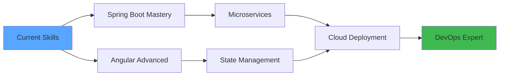

<div align="center">

<!-- Animated Header -->


<!-- Typing Animation -->
<p align="center">
  <a href="https://git.io/typing-svg">
    
  </a>
</p>

<!-- Profile Views Counter -->
<p align="center">
  
  
</p>

<!-- Social Badges with Animation -->
<p align="center">
  <a href="https://www.linkedin.com/in/wassel-aguech" target="_blank">
    
  </a>
  <a href="https://www.facebook.com/wasselblog" target="_blank">
    
  </a>
  <a href="https://www.instagram.com/wassel_aguech/" target="_blank">
    
  </a>
  <a href="https://www.youtube.com/channel/UCoFBqMHbsWAFdVbv7wmZBcw" target="_blank">
    
  </a>
  <a href="mailto:wasselaguech@gmail.com">
    
  </a>
</p>

---

## 🧑‍💻 About Me

```typescript
const wassel = {
    location: "Sfax, Tunisia 🇹🇳",
    role: "Full-Stack Web Developer",
    code: ["Java", "TypeScript", "JavaScript", "SQL"],
    technologies: {
        backEnd: {
            java: ["Spring Boot", "Spring Security", "Spring Data JPA", "Hibernate"],
            databases: ["MySQL", "PostgreSQL", "MongoDB", "SQL Server"],
            tools: ["Maven", "Postman", "Swagger"]
        },
        frontEnd: {
            frameworks: ["Angular", "Ionic"],
            styling: ["CSS3", "Bootstrap", "Tailwind CSS"],
            markup: ["HTML5"]
        },
        devOps: ["Docker", "Git", "CI/CD", "Jenkins"],
        testing: ["Selenium", "JUnit", "Mockito"],
        cloud: ["Firebase", "AWS (Learning)"]
    },
    currentFocus: "Mastering Microservices Architecture & Cloud Technologies",
    funFact: "I debug with console.log and I'm not ashamed! 😄"
};
```

---

## 🚀 Current Journey

<table>
  <tr>
    <td>🌱 Learning</td>
    <td>Advanced Spring Boot • Angular • DevOps • Microservices</td>
  </tr>
  <tr>
    <td>🔭 Working On</td>
    <td>Enterprise-level Full-Stack Applications</td>
  </tr>
  <tr>
    <td>🤝 Looking For</td>
    <td>Collaboration on Open Source Projects</td>
  </tr>
  <tr>
    <td>💬 Ask Me About</td>
    <td>Java • Spring Boot • Angular • TypeScript • Web Development</td>
  </tr>
  <tr>
    <td>📫 Reach Me</td>
    <td><a href="mailto:wasselaguech@gmail.com">wasselaguech@gmail.com</a></td>
  </tr>
</table>

---

## 🛠️ Tech Stack

### Languages
<p align="center">
  
  
  
  
  
  
</p>

### Frameworks & Libraries
<p align="center">
  
  
  
  
  
</p>

### Databases
<p align="center">
  
  
  
  
</p>

### DevOps & Tools
<p align="center">
  
  
  
  
  
</p>

---

## 📊 GitHub Statistics

<div align="center">
  
  
</div>

<div align="center">
  
  
</div>

---

## 🏆 GitHub Trophies

<p align="center">
  
</p>

---

## 📈 Contribution Graph


---

## 🎯 Featured Projects

<div align="center">

### 🚀 Coming Soon...
*Stay tuned for exciting full-stack projects!*

<!-- Example Project Cards - Replace with your actual projects -->
<!--
<a href="https://github.com/wassel-aguech/project1">
  
</a>
<a href="https://github.com/wassel-aguech/project2">
  
</a>
-->

</div>

---

## 💼 Skills Breakdown

<div align="center">

| Category | Skills | Proficiency |
|----------|--------|-------------|
| **Backend** | Java, Spring Boot, REST APIs | ⭐⭐⭐⭐⭐ |
| **Frontend** | Angular, TypeScript, HTML/CSS | ⭐⭐⭐⭐⭐ |
| **Database** | MySQL, PostgreSQL, MongoDB | ⭐⭐⭐⭐☆ |
| **DevOps** | Docker, Git, CI/CD | ⭐⭐⭐⭐☆ |
| **Testing** | Selenium, JUnit | ⭐⭐⭐☆☆ |

</div>

---

## 🎓 Continuous Learning Path



---

## 💡 Random Dev Quote

<p align="center">
  
</p>

---

## 🎵 Spotify Playing

<p align="center">
  <a href="https://open.spotify.com/user/YOUR_SPOTIFY_USER_ID">
    
  </a>
</p>

---

## 📫 Let's Connect!

<p align="center">
  <i>Feel free to reach out for collaborations, questions, or just a friendly chat!</i>
</p>

<p align="center">
  <a href="mailto:wasselaguech@gmail.com">
    
  </a>
</p>

<p align="center">
  
</p>

</div>

---

<div align="center">
  
  ### 💻 Show some ❤️ by starring some of my repositories!
  
  
  
</div>
